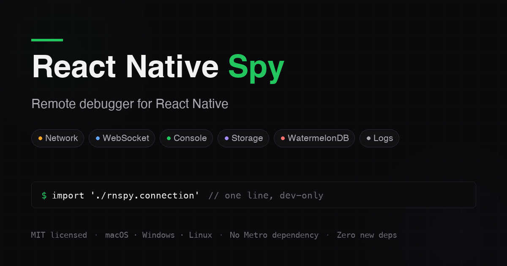

<p align="center">
  
</p>

<p align="center">
  <a href="./LICENSE"></a>
  <a href="https://github.com/Vaibhav-S-Mahajan/React-native-spy/releases/latest"></a>
  <a href="https://github.com/Vaibhav-S-Mahajan/React-native-spy/actions/workflows/ci.yml"></a>
  
</p>

**React Native Spy** is a lightweight Electron remote debugger for React Native.
Console logs, HTTP traffic, live WebSocket frames, device storage and
WatermelonDB — across multiple devices at once, with no Metro dependency and
nothing added to your `package.json`.

It spins up a WebSocket server on port `8097`, and your app connects by pasting a
short client snippet that monkey-patches `console.*`, `fetch`,
`XMLHttpRequest` and `WebSocket`. Everything streams to a Chrome-DevTools-style
UI on your desktop.

```
┌────────────────────┐   ws://HOST:8097   ┌─────────────────────────────┐
│  React Native App  │ ─────────────────► │  React Native Spy (Electron)│
│  (client snippet)  │                    │  6 inspector panels         │
└────────────────────┘                    └─────────────────────────────┘
```

## Why React Native Spy?

**RN DevTools still cannot read WebSocket frames.** If your app is realtime, the
official inspector goes dark exactly where you need it. React Native Spy streams
every frame with direction, payload and size.

**Flipper is a heavyweight install.** Native modules, plugin management, and a
footprint that outweighs the three things you actually reach for while building a
feature.

**One device at a time is not how you ship.** iOS and Android simulators plus a
physical device is a normal afternoon. Every event here is tagged by device and
bucketed into its own tab.

## The six panels

| Panel | What it gives you |
| ----- | ----------------- |
| **Network** | Every `fetch` and `XMLHttpRequest`, virtualized and newest-first. Headers, Payload, Response and Timing sub-tabs, with pretty-printed JSON/XML bodies. |
| **WebSocket** | The panel RN DevTools does not have. Connection list plus a live frame stream with direction arrows, and a *hide pings* filter for heartbeat noise. |
| **Console** | Five log levels with per-level counts, and a caller badge on every row (`App.tsx:42`) that opens the exact line in VS Code. |
| **Storage** | AsyncStorage and MMKV, browsable and editable from the desktop. Edit values inline, remove keys, no rebuild. |
| **WatermelonDB** | Inspect local database tables without a SQLite client. Row counts, offset pagination, read-only by design. |
| **Logs** | Server-side activity for when the connection itself is the bug — client connect/disconnect, server start/stop, errors. |

### Also worth knowing

- **Auto-reconnect with an offline queue** — the client retries every 2 seconds
  and buffers up to 500 events while disconnected, flushing on reconnect
- **Copy a request as** cURL (bash or PowerShell), `fetch`, Node fetch, Axios,
  HTTPie, raw HTTP, or a HAR entry
- **Hidden request rules** — silence analytics noise by name or URL fragment,
  with a live count of suppressed rows
- **Remote reload** — fast-refresh any connected device from its tab via RN
  `DevSettings`
- **Dev-only by construction** — the whole snippet sits inside `if (__DEV__)`, so
  it can never reach a production bundle
- **Fully reversible setup** — removing the integration deletes the generated
  file and strips the import
- **Virtualized and capped** — 2000 records per device (500 for server logs)
  keeps the UI responsive

## Compared to the alternatives

| | Spy | RN DevTools | Flipper |
| --- | :-: | :-: | :-: |
| Console logs | Yes | Yes | Yes |
| Network inspector | Yes | Yes | Yes |
| WebSocket frame inspector | **Yes** | No | Partial |
| Multi-device tabs, side by side | **Yes** | No | Partial |
| AsyncStorage / MMKV browse and edit | Yes | No | Yes |
| WatermelonDB table inspector | **Yes** | No | No |
| Copy as cURL, fetch, Axios, HTTPie, HAR | Yes | Partial | No |
| Open stack frame in VS Code | **Yes** | No | No |
| Zero runtime dependencies added | Yes | Yes | No |
| Works without Metro attached | Yes | No | Yes |

## Install

Grab a build for your platform from the
[latest release](https://github.com/Vaibhav-S-Mahajan/React-native-spy/releases/latest):
`.dmg` for macOS (Apple Silicon or Intel), `.exe` for Windows, `.AppImage` for
Linux.

Builds are **unsigned**, so the first launch needs one extra step: on macOS,
right-click the app and choose Open; on Windows, click "More info" then "Run
anyway" in the SmartScreen dialog.

## Quick start

```bash
npm install
npm run dev
```

Then point the app at your project — click **Project**, pick the folder holding
your `package.json`, and review the plan. Setup is split into a read-only plan
phase and an apply phase, so you approve a preview of every change before
anything touches disk. Modified files are backed up as `.rnspy.bak`, and a failed
write rolls the whole operation back.

Reload your app and the device tab appears with a green dot. Full steps, plus
manual setup, are in [docs/getting-started.md](./docs/getting-started.md).

> **Run it on a network you trust.** The WebSocket server binds to `0.0.0.0` so
> physical devices can reach it, and there is no authentication — anyone on your
> LAN can read the debug stream. See [SECURITY.md](./SECURITY.md).

## FAQ

**Does this add anything to my `package.json`?** No. The client is a
self-contained snippet, not an npm package. Automatic setup writes one file,
`rnspy.connection.js`, and gitignores it.

**Will it end up in my production build?** No. The entire snippet is wrapped in
`if (__DEV__)`, so Metro strips it from release bundles.

**Expo or bare React Native?** Both. Detection only requires `react-native` in
your dependencies, and Expo's `AppEntry.js` is skipped in favour of your own
`App.tsx`.

**Do I need Metro running?** No. The desktop app runs its own WebSocket server
and the client connects directly to it. Metro is only involved if you want
`/symbolicate` to resolve minified stack frames.

**How does it reach a physical device?** The server binds to `0.0.0.0` and
reports your LAN IPv4, preferring `192.168.*`, `10.*` and `172.16-31.*`. Device
and desktop just need to share a network.

**What happens to my data?** Nothing leaves your machine. There is no backend and
no telemetry.

## Documentation

- [Getting Started](./docs/getting-started.md) — install, run, connect your app, build a release
- [Features Walkthrough](./docs/features.md) — all six panels, device tabs, multi-device
- [Client SDK](./docs/client-sdk.md) — how the snippet works and how to embed it
- [Configuration](./docs/configuration.md) — port, hidden rules, project root, caps
- [Architecture](./docs/architecture.md) — main process, preload bridge, renderer, protocol
- [Design System](./docs/design-system.md) — surface layers, tokens, theming
- [Troubleshooting](./docs/troubleshooting.md) — common issues and fixes

## Tech stack

- **Electron** + **electron-vite** for the desktop shell
- **React 18** for the UI
- **ws** for the WebSocket server
- **lucide-react** for icons
- **react-hot-toast** for notifications
- **react-router-dom** for in-app routing

## Repository layout

| Path | Contents |
| ---- | -------- |
| `src/main/` | Electron main process — WebSocket server, updater, project setup |
| `src/preload/` | Context-isolated IPC bridge |
| `src/renderer/` | React UI, one component per inspector panel |
| `src/shared/` | The client snippet injected into your RN app |
| `landing/` | Marketing site, deployed to GitHub Pages |
| `docs/` | User documentation |

## Contributing

Bug reports, features and pull requests are all welcome. Start with
[CONTRIBUTING.md](./CONTRIBUTING.md) — it covers the dev setup, the two commands
CI runs, and how the code is organised. By participating you agree to the
[Code of Conduct](./CODE_OF_CONDUCT.md).

## License

[MIT](./LICENSE) © Vaibhav Mahajan
